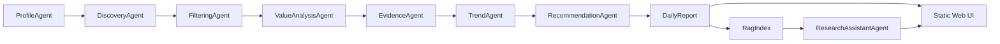

<p align="center">
  <h1 align="center">Personalized Research Intelligence Agent</h1>
  <p align="center">
    面向论文、代码仓库、工具与有依据研究问答的多智能体研究情报系统。
  </p>
  <p align="center">
    
    
    
    
  </p>
</p>

---

## 项目概览

Personalized Research Intelligence Agent 是一个本地研究助手，可以把分散的研究信号整理成每日决策简报。它会收集候选论文和代码仓库，过滤低价值条目，评估研究价值，检测趋势信号，并基于本地 RAG 证据回答问题。

> 图片占位：在 `docs/images/dashboard.png` 添加一张仪表盘截图。
>
> 建议说明："包含论文、仓库、趋势信号和助手上下文的每日简报。"

## 功能

| 模块 | 能力 |
| --- | --- |
| 发现 | 从示例、在线或混合数据源模式拉取候选内容。 |
| 筛选 | 拒绝弱相关内容、内容单薄的仓库、过时项目和证据不足的声明。 |
| 价值分析 | 评估相关性、新颖性、技术深度、证据、可复现性、实用性、趋势信号和研究机会。 |
| 趋势 | 为新兴主题和 baseline 机会生成短窗口趋势信号。 |
| 助手 | 根据报告上下文和 RAG 片段回答问题，并把来源返回到界面。 |
| 仓库问答 | 为选定仓库提供面向 baseline 的回答。 |
| 反馈 | 记录本地反馈事件，并轻量更新用户画像权重。 |

## 产品界面

Web 应用包含七个核心视图：

| 视图 | 用途 |
| --- | --- |
| Brief | 每日推荐动作、信号分布和最高价值条目。 |
| Papers | 带价值分析的论文排序情报。 |
| Repos | 面向 baseline 和实现检查的仓库情报。 |
| Trends | 7/30/90 天主题信号及其影响。 |
| Filtered | 已接受、已拒绝和低优先级候选项的审计记录。 |
| Saved | 本地反馈和后续跟进队列。 |
| Profile | 可编辑的研究兴趣、方法、应用和目标。 |

> 图片占位：在 `docs/images/assistant.png` 添加一张助手截图。
>
> 建议说明："助手抽屉根据选定报告或条目上下文进行回答。"

## 架构



按需智能体：

- `ResearchAssistantAgent`：基于报告和 RAG 的有依据问答。
- `RepoQAAgent`：仓库 baseline、可复现性和集成问题。
- `LangGraphAssistant`：安装 LangGraph 依赖后可用的可选流式助手图。

## 快速开始

使用 Python 3.11 或更高版本。在 Windows 上，请确认你使用的是真实 Python 解释器，而不是 Microsoft Store shim。

```powershell
$env:PYTHONPATH = "src"
& "C:\msys64\ucrt64\bin\python.exe" -m research_intel.cli --root . run-daily --profile default_user --report latest --source sample
```

启动 Web 应用：

```powershell
.\scripts\serve_web.ps1
```

打开：

```text
http://127.0.0.1:8765
```

## 数据源模式

| 模式 | 行为 |
| --- | --- |
| `sample` | 只使用 `data/samples/content_items.json`；最适合离线测试。 |
| `live` | 只使用在线连接器。 |
| `hybrid` | 优先使用在线连接器；如果在线结果较少，再混合示例数据。 |

## 配置

创建本地 `.env`：

```powershell
Copy-Item .env.example .env
```

常用配置：

```text
ENABLE_LLM_ANALYSIS=false
LLM_MODEL=qwen-plus
LLM_ANALYSIS_LIMIT=10
DASHSCOPE_API_KEY=
DASHSCOPE_BASE_URL=https://dashscope.aliyuncs.com/compatible-mode/v1
GITHUB_TOKEN=
SEMANTIC_SCHOLAR_API_KEY=
CONNECTOR_TIMEOUT_SECONDS=8
LIVE_MAX_QUERIES_PER_SOURCE=3
EMBEDDING_PROVIDER=local_hash
RAG_TOP_K=8
ASSISTANT_TRACE_LIMIT=100
```

启用 DashScope/Qwen 兼容的 LLM 调用：

```text
ENABLE_LLM_ANALYSIS=true
DASHSCOPE_API_KEY=<your key>
LLM_MODEL=<your model>
```

## RAG 与向量存储

默认检索使用无依赖的本地哈希 embedding provider，因此应用可以离线运行。

可选的 sentence-transformer embedding：

```powershell
pip install -e .[embeddings]
```

```text
EMBEDDING_PROVIDER=sentence_transformers
EMBEDDING_MODEL=BAAI/bge-base-en-v1.5
```

可选的 PostgreSQL + pgvector：

```powershell
pip install -e .[pgvector]
.\scripts\start_pgvector.ps1
.\scripts\init_pgvector.ps1
```

只在本地使用时，在 `.env` 中设置 `PGVECTOR_DSN`。不要提交真实数据库凭据。

## Web API

| 端点 | 说明 |
| --- | --- |
| `GET /api/profile` | 加载研究画像。 |
| `POST /api/profile` | 保存画像变更。 |
| `GET /api/report` | 加载经过脱敏处理的公开报告 payload。 |
| `POST /api/run` | 以非流式方式运行流水线。 |
| `GET /api/run/stream` | 流式输出流水线进度。 |
| `GET /api/candidates` | 加载最新候选条目。 |
| `POST /api/assistant` | 以非流式方式向助手提问。 |
| `GET /api/assistant/stream` | 流式输出助手进度和回答。 |
| `GET /api/feedback` | 加载本地反馈事件。 |
| `POST /api/feedback` | 记录反馈事件。 |

详细的数据源搜索错误会保留在后端产物和后端控制台输出中。前端只接收公开状态计数。

## 敏感文件

可以上传：

- `src/`
- `tests/`
- `scripts/`
- `docs/`
- `data/samples/`
- `reports/.gitkeep`
- `.env.example`

不要上传：

- `.env`
- `reports/*.md` 和 `reports/*.json`
- `data/runs/*.json`
- `data/runs/*.log`
- `data/runs/repo_cache/`
- `data/feedback/*.json`
- `.vscode/`
- `.venv/`、`.pgenv/`、缓存和生成的索引
- 任何包含私有研究计划或偏好的本地画像文件

如果生成文件或私有文件已经被 Git 跟踪，可以从 Git 索引中移除，同时保留本地文件：

```powershell
git rm --cached <path>
```

## 项目结构

```text
data/
  samples/                 公开示例内容
  profiles/                演示或本地研究画像
docs/
  architecture.md          系统架构说明
  roadmap.md               生产化路线图
reports/                   生成的报告，除 .gitkeep 外会被忽略
scripts/                   本地运行和服务脚本
src/research_intel/
  agents/                  流水线和助手智能体
  connectors/              外部数据源连接器
  evaluation/              助手回答检查
  llm/                     DashScope/Qwen 兼容客户端
  rag/                     Embedding、检索和 pgvector 支持
  web/static/              静态前端
  cli.py                   CLI 入口
  pipeline.py              每日编排逻辑
  storage.py               JSON 文件存储
tests/                     单元测试
```

## 测试

```powershell
$env:PYTHONPATH = "src"
& "C:\msys64\ucrt64\bin\python.exe" -B -m unittest discover -s tests
```

## GitHub 发布检查清单

```powershell
git status --short
git add .env.example .gitignore README.md pyproject.toml scripts src tests data/samples data/runs/.gitkeep data/feedback/.gitkeep docs reports/.gitkeep
git rm --cached --ignore-unmatch data/runs/latest_analyses.json data/runs/latest_candidates.json data/runs/latest_decisions.json data/feedback/default_user.json .vscode/settings.json
git status --short
git commit -m "Prepare research intelligence agent for public repo"
git push origin main
```
