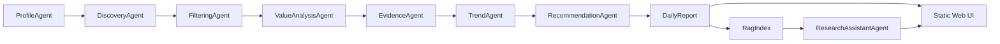

<p align="center">
  <h1 align="center">Personalized Research Intelligence Agent</h1>
  <p align="center">
    面向论文、代码仓库、工具与有依据研究问答的多智能体研究情报系统。
  </p>
  <p align="center">
    
    
    
    
  </p>
</p>

---

## 项目概览

Personalized Research Intelligence Agent 是一个本地研究助手，可以把分散的研究信号整理成每日决策简报。它会收集候选论文和代码仓库，过滤低价值条目，评估研究价值，检测趋势信号，并基于本地 RAG 证据回答问题。


> 图片占位：在 `docs/images/dashboard.png` 添加一张仪表盘截图。
>
> 建议说明："包含论文、仓库、趋势信号和助手上下文的每日简报。"


_包含论文、仓库、趋势信号和助手上下文的每日简报。_


## 功能

| 模块 | 能力 |
| --- | --- |
| 发现 | 从示例、在线或混合数据源模式拉取候选内容。 |
| 筛选 | 拒绝弱相关内容、内容单薄的仓库、过时项目和证据不足的声明。 |
| 价值分析 | 评估相关性、新颖性、技术深度、证据、可复现性、实用性、趋势信号和研究机会。 |
| 趋势 | 为新兴主题和 baseline 机会生成短窗口趋势信号。 |
| 助手 | 根据报告上下文和 RAG 片段回答问题，并把来源返回到界面。 |
| 仓库问答 | 为选定仓库提供面向 baseline 的回答。 |
| 反馈 | 记录本地反馈事件，并轻量更新用户画像权重。 |

## 产品界面

Web 应用包含七个核心视图：

| 视图 | 用途 |
| --- | --- |
| Brief | 每日推荐动作、信号分布和最高价值条目。 |
| Papers | 带价值分析的论文排序情报。 |
| Repos | 面向 baseline 和实现检查的仓库情报。 |
| Trends | 7/30/90 天主题信号及其影响。 |
| Filtered | 已接受、已拒绝和低优先级候选项的审计记录。 |
| Saved | 本地反馈和后续跟进队列。 |
| Profile | 可编辑的研究兴趣、方法、应用和目标。 |


_助手抽屉根据选定报告或条目上下文进行回答。_

## 架构



按需智能体：

- `ResearchAssistantAgent`：基于报告和 RAG 的有依据问答。
- `RepoQAAgent`：仓库 baseline、可复现性和集成问题。
- `LangGraphAssistant`：基于 LangGraph 的流式助手。

## 数据源模式

| 模式 | 行为 |
| --- | --- |
| `sample` | 只使用 `data/samples/content_items.json`；用于离线测试。 |
| `live` | 只使用在线api。 |
| `hybrid` | 优先使用在线连接器；如果在线结果较少，再混合知识库数据。 |

## RAG 与向量存储

默认检索使用sentence-transformer embedding

sentence-transformer embedding：

```powershell
pip install -e .[embeddings]
```

```text
EMBEDDING_PROVIDER=sentence_transformers
EMBEDDING_MODEL=BAAI/bge-base-en-v1.5
```

PostgreSQL + pgvector：

```powershell
pip install -e .[pgvector]
.\scripts\start_pgvector.ps1
.\scripts\init_pgvector.ps1
```

## 项目总结

Personalized Research Intelligence Agent 面向研究人员在日常论文、代码仓库和趋势信息筛选中的高频痛点，提供了一个本地优先、可审计、可扩展的研究情报工作台。它把候选发现、相关性筛选、价值分析、趋势判断、RAG 问答和用户反馈组织成一条流水线，让研究者可以更快判断“今天最值得读什么、哪些仓库值得作为 baseline、哪些方向正在形成机会”。

当前为初始版本：核心能力已经覆盖端到端研究简报生成和本地 Web 交互。后续可以继续增强在线连接器稳定性、长期用户画像学习、团队协作、评估体系和生产级向量存储，使其从个人研究助手逐步演进为可持续使用的研究情报系统。
