<p align="center">
  <h1 align="center">Personalized Research Intelligence Agent</h1>
  <p align="center">
    A multi-agent research intelligence system for daily paper, repo, and trend curation — with RAG-grounded Q&A.
  </p>
  <p align="center">
    
    
    
    
  </p>
</p>

---

## Overview

Personalized Research Intelligence Agent turns scattered research signals into a daily decision brief. It discovers candidate papers and repos from 5 live sources, filters by profile relevance, runs 8-dimensional value analysis with optional LLM enhancement, detects trending topics, and answers questions with RAG-grounded evidence and a hallucination risk score.


---

## Architecture

The system is built as a **LangGraph StateGraph** with 11 nodes and conditional routing. All 5 data-source connectors run in parallel via `asyncio.gather`, and LLM enhancement runs with bounded concurrency (semaphore=3).

```mermaid
flowchart LR
  Profile[ProfileAgent] --> Discovery[DiscoveryAgent\nasync parallel]
  Discovery -->|"live=0 → sample fallback"| Filter[FilteringAgent]
  Filter -->|"passed<3 → relax"| Supervisor[SupervisorNode]
  Supervisor --> Value[ValueAnalysisAgent\ntools + reflection]
  Value --> Evidence[EvidenceAgent]
  Evidence --> Trends[TrendAgent]
  Trends --> Recommend[RecommendationAgent]
  Recommend --> RAG[RagIndex]
  RAG --> Assistant[ResearchAssistantAgent\ngrounding check]
  Recommend --> Web[Static Web UI]
  Assistant --> Web
```



**On-demand agents:**
- `ResearchAssistantAgent` — RAG-grounded Q&A with grounding score
- `RepoQAAgent` — Baseline readiness, reproducibility, and integration Q&A
- `LangGraphAssistant` — Streaming multi-turn assistant (optional, requires OpenAI key)

---

## Features

| Module | Capability |
|--------|------------|
| Discovery | 5 parallel connectors (arXiv, Semantic Scholar, OpenAlex, PapersWithCode, GitHub) with sample fallback |
| Filtering | 4-tier relevance × quality scoring; auto-relaxes threshold when candidates are sparse |
| Tool Enrichment | Fills missing abstracts (arXiv), citation counts (S2), and star velocity (GitHub) before scoring |
| Value Analysis | 8-dimension scoring; LLM enhancement with reflection loop (max 2 retries, quality gate) |
| Evidence Review | Downgrades confidence when evidence or reproducibility signals are weak |
| Trends | 7 / 30 / 90-day topic frequency windows cross-referenced with user profile |
| Report | Ranked top papers, repos, tools, trends, and 5 actionable recommendations |
| Assistant Q&A | Hybrid dense + BM25 RAG retrieval; LLM answer with grounding score (hallucination detection) |
| Supervisor | Dynamic strategy node: raises LLM limit on high-priority overflow, skips unused tools |

---

## Web UI

Seven views in the single-page app:

| View | Purpose |
|------|---------|
| Brief | Daily actions, signal distribution, highest-value items |
| Papers | Ranked paper intelligence with value analysis |
| Repos | Baseline and implementation readiness |
| Trends | Topic signals across 7 / 30 / 90-day windows |
| Filtered | Audit trail: accepted, rejected, low-priority |
| Saved | Local feedback and follow-up queue |
| Profile | Editable research domains, methods, applications, goals |


---

## Quick Start

```bash
# Install
pip install -e .

# Run with sample data (offline)
research-intel run-daily --source sample

# Run with live sources
research-intel run-daily --source hybrid

# Use LangGraph pipeline (parallel connectors + conditional routing)
research-intel run-daily --source hybrid --use-langgraph

# Start web UI
research-intel serve-web
```

---

## Configuration

Copy `.env.example` to `.env` and fill in what you need:

```env
# Pipeline
USE_LANGGRAPH_PIPELINE=false   # true = LangGraph state machine

# LLM enhancement (optional)
ENABLE_LLM_ANALYSIS=false
DASHSCOPE_API_KEY=

# Data sources (optional but recommended)
GITHUB_TOKEN=
SEMANTIC_SCHOLAR_API_KEY=

# Embeddings (optional, improves RAG quality)
EMBEDDING_PROVIDER=local_hash  # or sentence_transformers
```

**sentence-transformers:**
```bash
pip install -e .[embeddings]
```

**PostgreSQL + pgvector:**
```bash
pip install -e .[pgvector]
research-intel init-pgvector
```

---

## Project Structure

```
src/research_intel/
├── agents/          # 10 agents (pipeline + on-demand)
├── connectors/      # 5 data-source connectors
├── tools/           # Tool registry + paper/repo tools
├── rag/             # Hybrid dense+BM25 RAG index
├── llm/             # Qwen/DashScope client
├── evaluation/      # Response evaluation
├── web/static/      # Static web UI (HTML/CSS/JS)
├── pipeline.py      # Original sequential pipeline
├── langgraph_pipeline.py  # LangGraph state-machine pipeline
├── mcp_server.py    # MCP tool server
└── web_server.py    # HTTP server
```

---

## Data Source Modes

| Mode | Behavior |
|------|---------|
| `sample` | Uses `data/samples/content_items.json` only; fully offline |
| `live` | Queries all 5 live connectors in parallel |
| `hybrid` | Live-first; blends sample data if live results are sparse |
