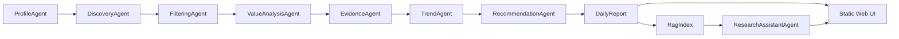

<p align="center">
  <h1 align="center">Personalized Research Intelligence Agent</h1>
  <p align="center">
    Local-first multi-agent research intelligence for papers, repositories, tools, benchmarks, and grounded research Q&A.
  </p>
  <p align="center">
    
    
    
    
  </p>
</p>

---

## Overview

Personalized Research Intelligence Agent is a local research assistant that turns scattered research signals into a daily decision brief. It collects candidate papers and repositories, filters low-value items, scores research value, detects trend signals, and answers questions with local RAG evidence.

The current implementation is intentionally lightweight: a Python package, JSON file storage, a standard-library web server, and a static frontend. It can run fully offline from sample data, or connect to live sources such as arXiv, Semantic Scholar, OpenAlex, Papers with Code, and GitHub.

> Image slot: add a dashboard screenshot at `docs/images/dashboard.png`.
>
> Suggested caption: "Daily brief with ranked papers, repositories, trend signals, and assistant context."

## What It Does

| Area | Capability |
| --- | --- |
| Discovery | Pulls candidate content from sample, live, or hybrid source modes. |
| Filtering | Rejects weakly related content, thin repositories, stale projects, and low-evidence claims. |
| Value analysis | Scores relevance, novelty, technical depth, evidence, reproducibility, utility, trend signal, and research opportunity. |
| Trends | Produces short-window trend signals for emerging topics and baseline opportunities. |
| Assistant | Answers questions from report context and RAG chunks, with sources returned to the UI. |
| Repo QA | Gives baseline-oriented answers for selected repositories. |
| Feedback | Records local feedback events and lightly updates profile weights. |

## Product Surface

The web app has seven core views:

| View | Purpose |
| --- | --- |
| Brief | Daily recommended actions, signal mix, and highest-value items. |
| Papers | Ranked paper intelligence with value analysis. |
| Repos | Repository intelligence for baselines and implementation inspection. |
| Trends | 7/30/90-day topic signals and implications. |
| Filtered | Audit trail for accepted, rejected, and low-priority candidates. |
| Saved | Local feedback and follow-up queue. |
| Profile | Editable research interests, methods, applications, and goals. |

> Image slot: add an assistant screenshot at `docs/images/assistant.png`.
>
> Suggested caption: "Assistant drawer answering from selected report or item context."

## Architecture



On-demand agents:

- `ResearchAssistantAgent`: report and RAG-grounded Q&A.
- `RepoQAAgent`: repository baseline, reproducibility, and integration questions.
- `LangGraphAssistant`: optional streaming assistant graph when LangGraph dependencies are installed.

## Quick Start

Use Python 3.11 or newer. On Windows, make sure you are using a real Python interpreter rather than the Microsoft Store shim.

```powershell
$env:PYTHONPATH = "src"
& "C:\msys64\ucrt64\bin\python.exe" -m research_intel.cli --root . run-daily --profile default_user --report latest --source sample
```

Start the web app:

```powershell
.\scripts\serve_web.ps1
```

Open:

```text
http://127.0.0.1:8765
```

## Source Modes

| Mode | Behavior |
| --- | --- |
| `sample` | Uses only `data/samples/content_items.json`; best for offline testing. |
| `live` | Uses live connectors only. |
| `hybrid` | Uses live connectors first, then mixes sample data if live results are sparse. |

## Configuration

Create a local `.env`:

```powershell
Copy-Item .env.example .env
```

Common settings:

```text
ENABLE_LLM_ANALYSIS=false
LLM_MODEL=qwen-plus
LLM_ANALYSIS_LIMIT=10
DASHSCOPE_API_KEY=
DASHSCOPE_BASE_URL=https://dashscope.aliyuncs.com/compatible-mode/v1
GITHUB_TOKEN=
SEMANTIC_SCHOLAR_API_KEY=
CONNECTOR_TIMEOUT_SECONDS=8
LIVE_MAX_QUERIES_PER_SOURCE=3
EMBEDDING_PROVIDER=local_hash
RAG_TOP_K=8
ASSISTANT_TRACE_LIMIT=100
```

To enable DashScope/Qwen-compatible LLM calls:

```text
ENABLE_LLM_ANALYSIS=true
DASHSCOPE_API_KEY=<your key>
LLM_MODEL=<your model>
```

## RAG And Vector Storage

Default retrieval uses a dependency-free local hash embedding provider, so the app can run offline.

Optional sentence-transformer embeddings:

```powershell
pip install -e .[embeddings]
```

```text
EMBEDDING_PROVIDER=sentence_transformers
EMBEDDING_MODEL=BAAI/bge-base-en-v1.5
```

Optional PostgreSQL + pgvector:

```powershell
pip install -e .[pgvector]
.\scripts\start_pgvector.ps1
.\scripts\init_pgvector.ps1
```

Set `PGVECTOR_DSN` in `.env` for local use only. Do not commit real database credentials.

## Web API

| Endpoint | Description |
| --- | --- |
| `GET /api/profile` | Load a research profile. |
| `POST /api/profile` | Save profile changes. |
| `GET /api/report` | Load a sanitized public report payload. |
| `POST /api/run` | Run the pipeline without streaming. |
| `GET /api/run/stream` | Stream pipeline progress. |
| `GET /api/candidates` | Load latest candidate items. |
| `POST /api/assistant` | Ask the assistant without streaming. |
| `GET /api/assistant/stream` | Stream assistant progress and answer. |
| `GET /api/feedback` | Load local feedback events. |
| `POST /api/feedback` | Record a feedback event. |

Detailed source-search errors stay in backend artifacts and backend console output. The frontend receives only public status counts.

## Sensitive Files

Safe to upload:

- `src/`
- `tests/`
- `scripts/`
- `docs/`
- `data/samples/`
- `reports/.gitkeep`
- `.env.example`

Do not upload:

- `.env`
- `reports/*.md` and `reports/*.json`
- `data/runs/*.json`
- `data/runs/*.log`
- `data/runs/repo_cache/`
- `data/feedback/*.json`
- `.vscode/`
- `.venv/`, `.pgenv/`, caches, and generated indexes
- Any local profile file that contains private research plans or preferences

If a generated or private file has already been tracked, remove it from the Git index while keeping the local file:

```powershell
git rm --cached <path>
```

## Project Layout

```text
data/
  samples/                 Public sample content
  profiles/                Demo or local research profiles
docs/
  architecture.md          System architecture notes
  roadmap.md               Production roadmap
reports/                   Generated reports, ignored except .gitkeep
scripts/                   Local run and service scripts
src/research_intel/
  agents/                  Pipeline and assistant agents
  connectors/              External source connectors
  evaluation/              Assistant answer checks
  llm/                     DashScope/Qwen-compatible client
  rag/                     Embeddings, retrieval, and pgvector support
  web/static/              Static frontend
  cli.py                   CLI entrypoint
  pipeline.py              Daily orchestration
  storage.py               JSON file store
tests/                     Unit tests
```

## Tests

```powershell
$env:PYTHONPATH = "src"
& "C:\msys64\ucrt64\bin\python.exe" -B -m unittest discover -s tests
```

## GitHub Publish Checklist

```powershell
git status --short
git add .env.example .gitignore README.md pyproject.toml scripts src tests data/samples data/runs/.gitkeep data/feedback/.gitkeep docs reports/.gitkeep
git rm --cached --ignore-unmatch data/runs/latest_analyses.json data/runs/latest_candidates.json data/runs/latest_decisions.json data/feedback/default_user.json .vscode/settings.json
git status --short
git commit -m "Prepare research intelligence agent for public repo"
git push origin main
```
