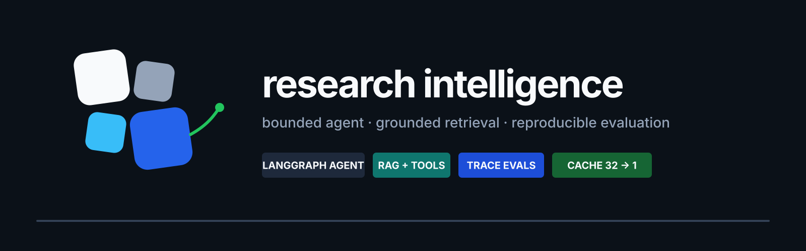
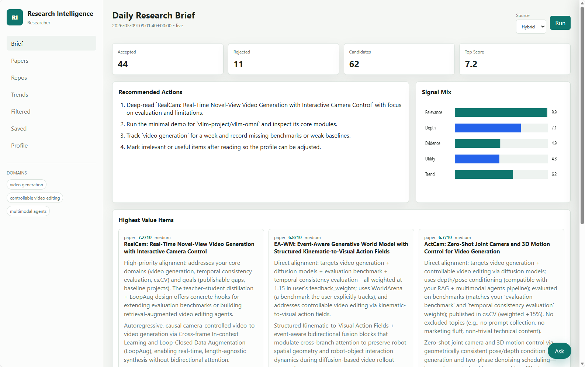
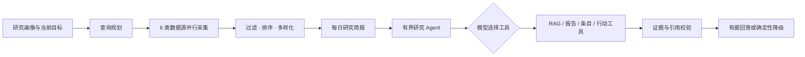
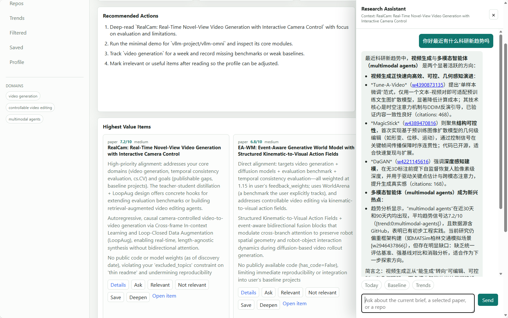

<p align="center">
  
</p>

<p align="center">
  面向研究人员的个性化论文、代码仓库与趋势情报系统。<br>
  用有界 Agent、可追溯证据和可复现实验，把分散的信息转化为每日研究决策。
</p>

<p align="center">
  <a href="README_en.md">English</a> ·
  <a href="#快速开始">快速开始</a> ·
  <a href="docs/architecture.md">系统架构</a> ·
  <a href="docs/assistant-agent-evaluation.md">Agent 评测</a>
</p>

<p align="center">
  
  
  
  
</p>

## 项目概览

Personalized Research Intelligence Agent 从 arXiv、Semantic Scholar、OpenAlex、PapersWithCode、GitHub 与 Hugging Face 等来源采集研究信号，结合用户画像完成过滤、排序、多样化和每日简报生成。报告生成后，独立研究 Agent 可通过 RAG 与工具调用回答追问，并在输出前核验主张与引用证据。

项目将 Agent 的工具选择、调用预算、证据边界、确定性兜底和实验轨迹设计为可控制、可验证、可复现的工程能力。



## 核心工程亮点

| 能力 | 工程实现 | 可验证结果 |
|---|---|---|
| **有界 Agent 执行** | 基于 LangGraph 构建 `decide → execute_tools → decide` 循环，由模型选择工具，执行引擎限制迭代次数、工具预算与无效调用，并在输出前进行证据核验和确定性降级 | 60 道中英文开发集任务每题重复 3 次，共 **180 条 Qwen 轨迹，预算合规率 100%** |
| **轨迹评测与实验复现** | 记录工具、参数、证据、引用、终止模式与配置指纹；支持复用已完成记录，只补跑未完成调用 | 完成 **60 题、180 条轨迹**的可追溯评测；复用 **121 条**有效记录，补跑 **59 条**未完成记录 |
| **RAG 缓存与并发控制** | 中间缓存绑定数据与配置版本；Single-flight 合并相同并发请求，避免重复构建索引和复用过期结果 | 1,000-chunk 本地微基准中，缓存路径 P50 从 **46.43 ms 降至 0.210 ms（约 99.55%）**；32 路同请求仅触发 **1 次**后端计算 |

> 指标均来自仓库内提交的评测与基准产物。缓存数据测量的是进程内索引构建、检索及缓存路径，不包含网络和模型耗时。

## 系统如何工作


```mermaid
flowchart LR
    A[研究画像与当前目标] --> B[查询规划]
    B --> C[6 类数据源并行采集]
    C --> D[过滤 · 排序 · 多样化]
    D --> E[每日研究简报]
    E --> F[有界研究 Agent]
    F --> G{模型选择工具}
    G --> H[RAG / 报告 / 条目 / 行动工具]
    H --> I[证据与引用校验]
    I --> J[有据回答或确定性降级]
```

系统包含两个边界清晰的 LangGraph 工作流：

- **推荐工作流**：负责画像加载、查询规划、多源采集、个性化排序、多样性控制、质量门控、趋势计算与报告持久化。
- **研究 Agent 工作流**：负责报告生成后的问答，运行有界工具循环、结构化轨迹记录、主张证据核验与安全降级，不参与推荐排序。



## 主要能力

- 六类论文、模型与代码数据源 Connector，支持并行检索与来源隔离。
- 显式画像、长期/短期兴趣、负反馈、已读历史和新颖度联合排序。
- MMR 多样化、来源上限、探索位与确定性质量门控。
- dense + BM25 混合 RAG、报告工具、条目工具和行动工具。
- SQLite checkpoint、run ID 幂等持久化、曝光记录与反馈学习。
- 节点级轨迹、Token/延迟记录、缓存命中与终止模式观测。
- 可选 PostgreSQL + pgvector 存储与外部 MCP 工具接口。

## 快速开始

运行环境：Python 3.11+，支持 Linux 与 macOS。

```bash
# 安装项目
pip install -e .

# 使用内置样例数据生成每日简报（无需 API Key）
research-intel run-daily --source sample

# 优先使用在线数据源，无可用结果时回退样例数据
research-intel run-daily --source hybrid

# 启动 Web 界面
research-intel serve-web
```

运行后访问终端输出的本地地址。未配置模型密钥时，系统仍可使用样例数据和本地确定性能力运行。

## 配置

复制 `.env.example` 为 `.env`，按需填写：

```env
ENABLE_LLM_ANALYSIS=false
LLM_MODEL=qwen3.7-max-2026-06-08
DASHSCOPE_API_KEY=
DASHSCOPE_BASE_URL=https://dashscope.aliyuncs.com/compatible-mode/v1

GITHUB_TOKEN=
SEMANTIC_SCHOLAR_API_KEY=

EMBEDDING_PROVIDER=local_hash
```

- 开启 Qwen 工具调用：设置 `DASHSCOPE_API_KEY`，并将 `ENABLE_LLM_ANALYSIS=true`。
- 默认嵌入提供方 `local_hash` 完全离线且不会下载模型。
- 启用语义嵌入：`pip install -e ".[embeddings]"`，再设置 `EMBEDDING_PROVIDER=sentence_transformers`。
- 启用 PostgreSQL + pgvector：`pip install -e ".[pgvector]"`，然后运行 `research-intel init-pgvector`。

密钥只应存在于本地环境或受保护的 CI Secret 中，不要提交 `.env`、轨迹日志或运行产物。

## 评测与基准

### Agent 轨迹评测

仓库提供离线 evaluator、自测 fixture、公开开发集与分割清晰的 live-Qwen 评测协议。评测从最终答案向前追踪工具选择、参数、执行证据、引用和主张支持关系，并通过数据集哈希、配置指纹和运行清单保证实验条件可追溯。

评测结果覆盖 60 道中英文开发集任务、180 条 Qwen 轨迹，并记录工具调用、引用证据与预算合规性。

### RAG 缓存基准

基准覆盖 1,000-chunk 缓存路径与 32 路相同请求的 Single-flight 验证，用于衡量缓存命中延迟和并发计算合并效果。

## 项目结构

```text
src/research_intel/
├── agents/          # 有界研究 Agent、上下文、证据校验与缓存
├── workflows/       # 推荐工作流的状态、节点与路由
├── connectors/      # 六类外部数据源 Connector
├── recommendation/  # 画像、排序、多样化、质量门控与报告
├── tools/           # 论文、仓库及报告工具注册表
├── rag/             # dense + BM25 与 pgvector 存储
├── evaluation/      # 轨迹、模型与个性化评测
├── llm/             # Qwen / DashScope 客户端
├── web/static/      # Web 产品界面
├── mcp_server.py    # 外部 MCP 服务
└── web_server.py    # HTTP 服务
```

## 深入阅读

- [系统架构](docs/architecture.md)
- [项目路线图](docs/roadmap.md)

## 维护者

由 [@OHHZZ](https://github.com/OHHZZ) 设计与维护。
