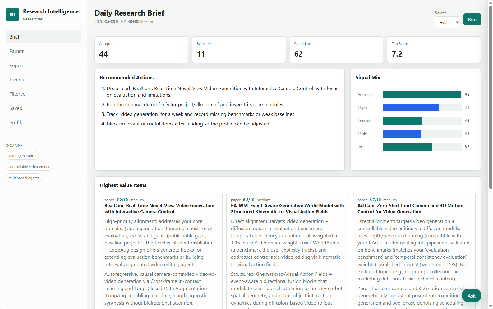
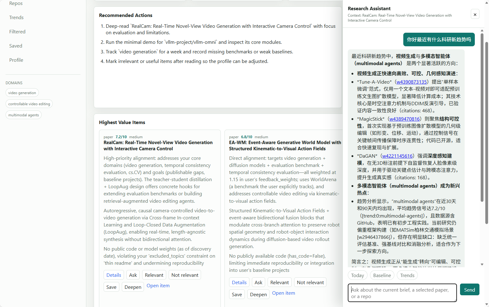
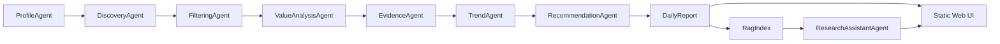

<p align="center">
  <h1 align="center">Personalized Research Intelligence Agent</h1>
  <p align="center">
    Local-first multi-agent research intelligence for papers, repositories, tools, benchmarks, and grounded research Q&A.
  </p>
  <p align="center">
    
    
    
    
  </p>
</p>

---

## Overview

Personalized Research Intelligence Agent is a local research assistant that turns scattered research signals into a daily decision brief. It collects candidate papers and code repositories, filters low-value items, evaluates research value, detects trend signals, and answers questions with local RAG evidence.



_Daily brief with papers, repositories, trend signals, and assistant context._

## Features

| Module | Capability |
| --- | --- |
| Discovery | Pulls candidate content from sample, live, or hybrid source modes. |
| Filtering | Rejects weakly related content, thin repositories, stale projects, and low-evidence claims. |
| Value analysis | Evaluates relevance, novelty, technical depth, evidence, reproducibility, utility, trend signals, and research opportunities. |
| Trends | Produces short-window trend signals for emerging topics and baseline opportunities. |
| Assistant | Answers questions from report context and RAG chunks, with sources returned to the UI. |
| Repo QA | Provides baseline-oriented answers for selected repositories. |
| Feedback | Records local feedback events and lightly updates profile weights. |

## Product Surface

The web app includes seven core views:

| View | Purpose |
| --- | --- |
| Brief | Daily recommended actions, signal mix, and highest-value items. |
| Papers | Ranked paper intelligence with value analysis. |
| Repos | Repository intelligence for baselines and implementation inspection. |
| Trends | 7/30/90-day topic signals and implications. |
| Filtered | Audit trail for accepted, rejected, and low-priority candidates. |
| Saved | Local feedback and follow-up queue. |
| Profile | Editable research interests, methods, applications, and goals. |



_The assistant drawer answers from the selected report or item context._

## Architecture



On-demand agents:

- `ResearchAssistantAgent`: report- and RAG-grounded Q&A.
- `RepoQAAgent`: repository baseline, reproducibility, and integration questions.
- `LangGraphAssistant`: LangGraph-based streaming assistant.

## Source Modes

| Mode | Behavior |
| --- | --- |
| `sample` | Uses only `data/samples/content_items.json`; intended for offline testing. |
| `live` | Uses only online APIs. |
| `hybrid` | Uses live connectors first, then mixes in knowledge base data if live results are sparse. |

## RAG And Vector Storage

Default retrieval uses sentence-transformer embeddings.

Sentence-transformer embeddings:

```powershell
pip install -e .[embeddings]
```

```text
EMBEDDING_PROVIDER=sentence_transformers
EMBEDDING_MODEL=BAAI/bge-base-en-v1.5
```

PostgreSQL + pgvector:

```powershell
pip install -e .[pgvector]
.\scripts\start_pgvector.ps1
.\scripts\init_pgvector.ps1
```

## Project Summary

Personalized Research Intelligence Agent addresses the recurring pain points researchers face when filtering daily papers, code repositories, and trend information. It provides a local-first, auditable, and extensible research intelligence workspace. By organizing candidate discovery, relevance filtering, value analysis, trend detection, RAG Q&A, and user feedback into one pipeline, it helps researchers decide faster what is most worth reading today, which repositories are suitable as baselines, and which directions are becoming promising opportunities.

The current version is an initial release: the core capabilities already cover end-to-end research brief generation and local web interaction. Future work can further improve live connector stability, long-term profile learning, team collaboration, evaluation workflows, and production-grade vector storage, evolving the project from a personal research assistant into a sustainable research intelligence system.
