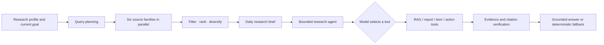

<p align="center">
  
</p>

<p align="center">
  Personalized paper, repository, and trend intelligence for researchers.<br>
  Bounded agents, traceable evidence, and reproducible experiments turn scattered signals into a daily research decision brief.
</p>

<p align="center">
  <a href="README.md">中文</a> ·
  <a href="#quick-start">Quick Start</a> ·
  <a href="docs/architecture.md">Architecture</a> ·
  <a href="docs/assistant-agent-evaluation.md">Agent Evaluation</a>
</p>

<p align="center">
  
  
  
  
</p>

## Overview

Personalized Research Intelligence Agent collects research signals from arXiv, Semantic Scholar, OpenAlex, PapersWithCode, GitHub, and Hugging Face, then filters, ranks, diversifies, and turns them into a daily brief. After a report is generated, a separate research agent answers follow-up questions with RAG and model-selected tools, verifying claims against cited evidence before returning an answer.

The engineering focus is controlled autonomy: tool choice, execution budgets, evidence boundaries, deterministic fallback, and experiment traces are explicit system concerns rather than hidden model behavior.


## Engineering Highlights

| Capability | Implementation | Verifiable result |
|---|---|---|
| **Bounded Agent execution** | A LangGraph `decide → execute_tools → decide` loop lets the model select tools while the runtime bounds iterations, tool calls, and invalid attempts, then verifies evidence before deterministic fallback | **180 Qwen trajectories** from 60 bilingual development tasks repeated three times, with **100% budget compliance** |
| **Trajectory evaluation and reproducibility** | Traces capture tools, arguments, evidence, citations, terminal mode, and configuration fingerprints; completed records can be reused while only incomplete calls are rerun | Evaluated **60 tasks / 180 trajectories** by reusing **121** valid records and rerunning **59** incomplete records |
| **RAG cache and concurrency control** | Intermediates are bound to data/config versions, while Single-flight coalesces identical concurrent requests to prevent duplicate index construction and stale reuse | In a local 1,000-chunk microbenchmark, cached-path P50 fell from **46.43 ms to 0.210 ms (~99.55%)**; 32 identical requests triggered **one** backend computation |

> Metrics are backed by committed evaluation and benchmark artifacts. Cache figures cover process-local index construction/search and cache paths; network and model time are excluded.

## How It Works


```mermaid
flowchart LR
    A[Research profile and current goal] --> B[Query planning]
    B --> C[Six source families in parallel]
    C --> D[Filter · rank · diversify]
    D --> E[Daily research brief]
    E --> F[Bounded research agent]
    F --> G{Model selects a tool}
    G --> H[RAG / report / item / action tools]
    H --> I[Evidence and citation verification]
    I --> J[Grounded answer or deterministic fallback]
```

The product uses two boundary-separated LangGraph workflows:

- **Recommendation workflow:** profile loading, query planning, multi-source discovery, personalized ranking, diversity control, quality gating, trends, and idempotent report persistence.
- **Research agent workflow:** post-report Q&A with a bounded tool loop, structured trace capture, claim-evidence verification, and safe fallback. It does not participate in recommendation ranking.


## Features

- Six paper, model, and repository connector families with parallel retrieval and source isolation.
- Ranking over explicit, long-term, short-term, negative, seen-item, and novelty signals.
- MMR diversity, source caps, exploration slots, and deterministic quality gates.
- Dense + BM25 RAG plus report, selected-item, and recommended-action tools.
- SQLite checkpoints, run-ID idempotency, exposure receipts, and feedback learning.
- Node-level traces with token/latency, cache-hit, and terminal-mode telemetry.
- Optional PostgreSQL + pgvector storage and an external MCP tool surface.

## Quick Start

Requires Python 3.11+ on Linux or macOS.

```bash
# Install
pip install -e .

# Generate a daily brief from bundled sample data (no API key required)
research-intel run-daily --source sample

# Prefer live sources and fall back to sample data when none are usable
research-intel run-daily --source hybrid

# Start the Web UI
research-intel serve-web
```

Open the local URL printed by the server. Without model credentials, sample mode and deterministic local capabilities remain available.

## Configuration

Copy `.env.example` to `.env` and fill in only what you need:

```env
ENABLE_LLM_ANALYSIS=false
LLM_MODEL=qwen3.7-max-2026-06-08
DASHSCOPE_API_KEY=
DASHSCOPE_BASE_URL=https://dashscope.aliyuncs.com/compatible-mode/v1

GITHUB_TOKEN=
SEMANTIC_SCHOLAR_API_KEY=

EMBEDDING_PROVIDER=local_hash
```

- To enable Qwen tool calling, set `DASHSCOPE_API_KEY` and `ENABLE_LLM_ANALYSIS=true`.
- The default `local_hash` embedding provider is offline and downloads no model.
- For semantic embeddings, run `pip install -e ".[embeddings]"` and set `EMBEDDING_PROVIDER=sentence_transformers`.
- For PostgreSQL + pgvector, run `pip install -e ".[pgvector]"`, then `research-intel init-pgvector`.

Keep credentials in the local environment or protected CI secrets. Never commit `.env`, traces, or runtime artifacts.

## Evaluation and Benchmarks

### Agent trajectory evaluation

The repository includes an offline evaluator, self-test fixtures, a public development set, and a split-aware live-Qwen protocol. Evaluation traces backwards from the final answer through tool choice, arguments, execution evidence, citations, and claim support. Dataset hashes, configuration fingerprints, and run manifests keep experiments attributable and reproducible.

The evaluation covers 60 bilingual development tasks and 180 Qwen trajectories, recording tool calls, citation evidence, and budget compliance.

### RAG cache benchmark

The benchmark covers a 1,000-chunk cache path and 32 identical concurrent requests, measuring cache-hit latency and Single-flight request coalescing.

## Project Structure

```text
src/research_intel/
├── agents/          # bounded agent, context, evidence verification, cache
├── workflows/       # recommendation state, nodes, and routes
├── connectors/      # six external source connector families
├── recommendation/  # profiles, ranking, diversity, critic, reports
├── tools/           # paper, repository, and report tool registry
├── rag/             # dense + BM25 and pgvector storage
├── evaluation/      # trajectory, model, and personalization evaluation
├── llm/             # Qwen / DashScope client
├── web/static/      # product UI
├── mcp_server.py    # external MCP server
└── web_server.py    # HTTP server
```

## Further Reading

- [Architecture](docs/architecture.md)
- [Roadmap](docs/roadmap.md)

## Maintainer

Designed and maintained by [@OHHZZ](https://github.com/OHHZZ).
